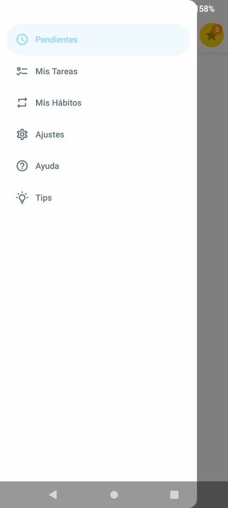
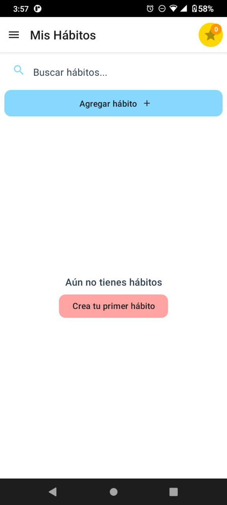
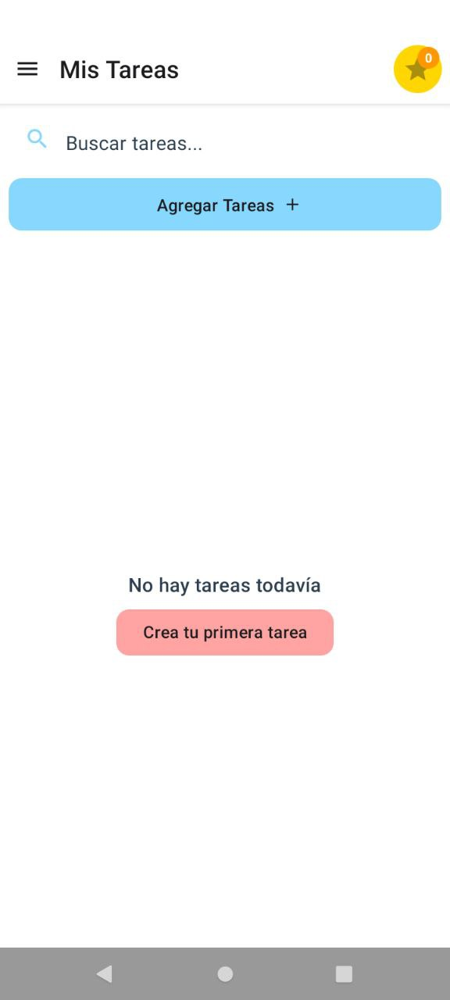
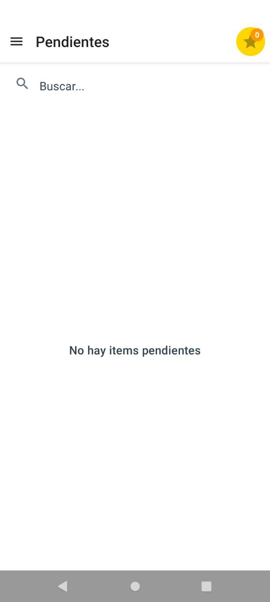
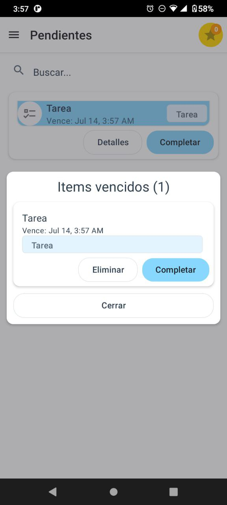
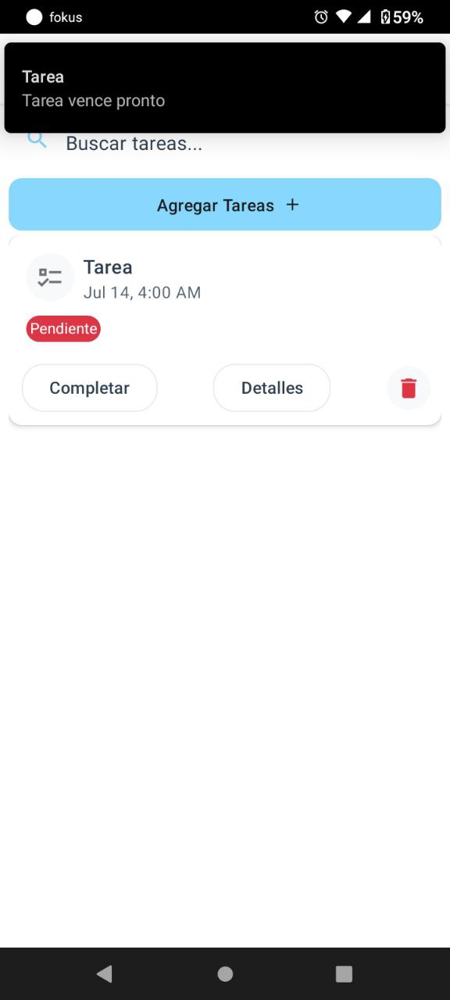
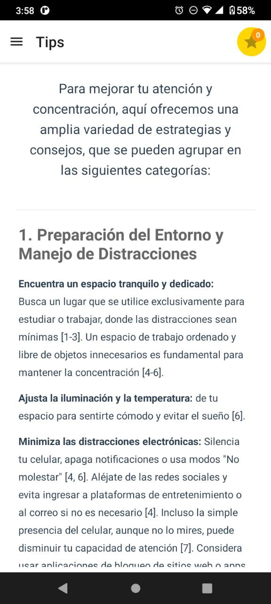
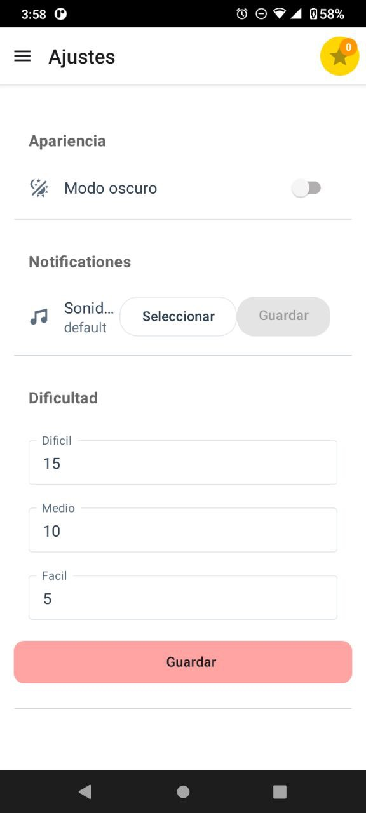
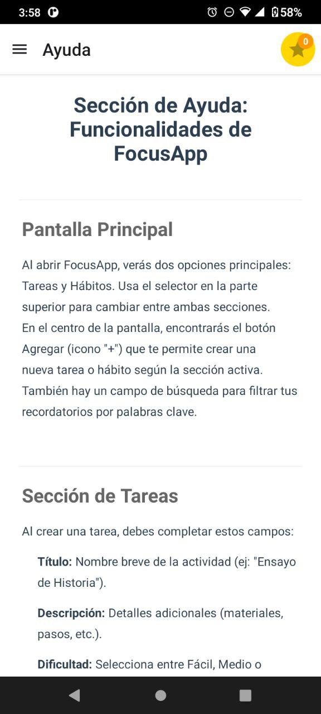

# FokusApp

FokusApp es una aplicación móvil para el seguimiento de hábitos y tareas, diseñada para ayudar a estudiantes de bachillerato a organizarse académica, profesional y personalmente. Su objetivo principal es ejecutar recordatorios para que el usuario realice los hábitos o tareas registradas, resolviendo la dificultad de organización mediante notificaciones y un sistema sencillo de gamificación basado en puntos y rachas.

## Características principales
- Registro y seguimiento de hábitos y tareas
- Recordatorios automáticos mediante notificaciones
- Sistema de puntos y rachas para motivar el uso
- Interfaz fácil de usar

## Público objetivo
Principalmente estudiantes de bachillerato que tienen dificultades para lidiar con sus tareas académicas, aunque puede ser útil para cualquier persona que busque mejorar su organización personal.

## Descarga la app

[Link (solo Android)](https://github.com/hanumonke/focusapp/releases/download/v1.0.0/focusapp.beta.apk)

## Instalación y ejecución

### Requisitos
- Node.js y npm
- Expo CLI (`npm install -g expo-cli`)

### Instalación
1. Clona el repositorio:
   ```bash
   git clone <repo-url>
   cd focusapp
   ```
2. Instala las dependencias:
   ```bash
   npm install
   ```

### Ejecución
- Para iniciar la app en modo desarrollo:
  ```bash
  npx expo start
  ```
- Para compilar usando EAS (Expo Application Services):
  ```bash
  npx eas build --platform android # o ios
  ```
  (Requiere tener configurado EAS y una cuenta de Expo)

## Dependencias principales
- **React Native Paper**: para estilos y componentes UI
- **React Native Paper Dates**: para selección de fecha y hora
- **Expo**: notificaciones, routing, almacenamiento local y otras utilidades

## Créditos
- Desarrollado con ayuda de **Cursor** y **GitHub Copilot** como asistentes para generar, depurar y discutir sobre el código.

## Estructuras de datos principales
A continuación se muestran las estructuras de datos utilizadas para tareas y hábitos (ver `db/types.ts`):

```typescript
export interface ITask {
    id: string;
    title: string;
    description: string;
    dueDate: string | null; // ISO
    tags: string[];
    isCompleted: boolean;
    reminders: IReminder[];
    createdAt: string;
    updatedAt: string;
    difficulty: TaskDifficulty;
}

export interface IHabit {
    id: string;
    title: string;
    description: string;
    tags: string[];
    recurrence: IHabitRecurrence;
    reminderOnTime: IHabitReminderConfig;   // Notificación puntual
    reminderBefore?: IHabitReminderConfig;  // Notificación antes (opcional)
    currentStreak: number;
    bestStreak: number;
    lastCompletedDate: string | null; // YYYY-MM-DD
    completionHistory: string[]; // YYYY-MM-DD[]
    createdAt: string;
    updatedAt: string;
}
```

## Capturas de pantalla
A continuación se muestran capturas de pantalla de las principales pantallas de la app:

- **Menú principal**
  
  

- **Pantalla de hábitos**
  
  

- **Nueva tarea**
  
  

- **Tareas**
  
  

- **Tarea creada**
  
  

- **Pendientes**
  
  

- **Vencidas**
  
  

- **Nuevo hábito**
  
  

- **Notificación**
  
  

- **Tips**
  
  

- **Ajustes**
  
  

- **Ayuda**
  
  


